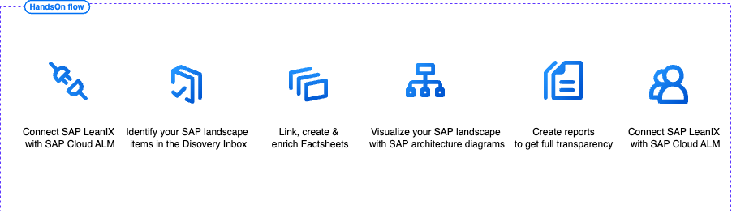
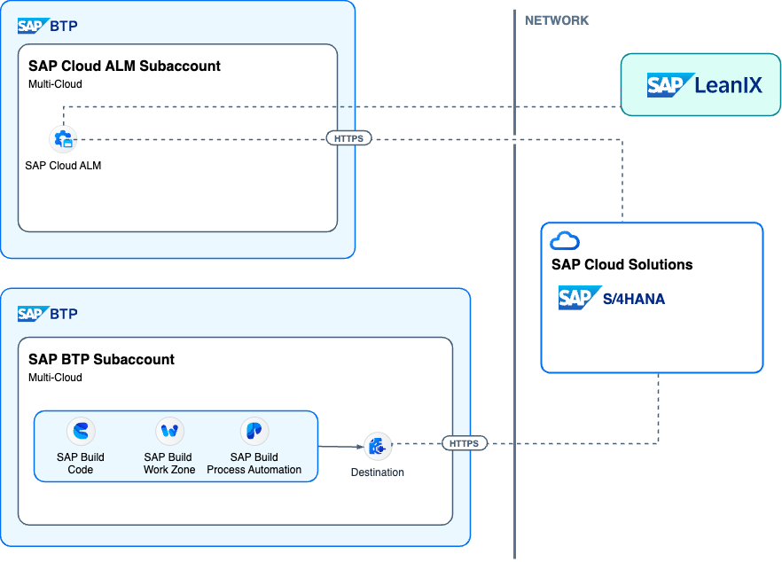
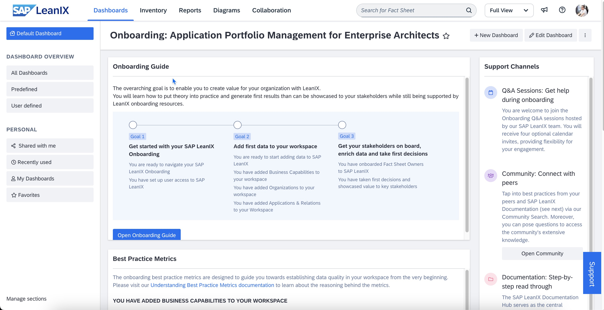

# Getting started

## Demo flow

This hands-on experience walks you through the end-to-end execution how to use SAP LeanIX Landscape discovery in combination with SAP BTP. In detail you will execute the folowing steps:

## Architecture

The following diagram shows the overall architecture of the SAP LeanIX Landscape discovery:

## System access

Please use the credentials we share with you at the beginning of the session to access the following systems:

SAP LeanIX tenant URL: [eu.leanix.net/dsagTechExchange2025](https://eu.leanix.net/dsagTechExchange2025)

You should see a screen similiar to this:

Login with one of these users (password shared in the session)

* jens.rieskamp+tx01@leanix.net
* jens.rieskamp+tx02@leanix.net
* jens.rieskamp+tx03@leanix.net
* jens.rieskamp+tx04@leanix.net
* jens.rieskamp+tx05@leanix.net
* jens.rieskamp+tx06@leanix.net
* jens.rieskamp+tx07@leanix.net
* jens.rieskamp+tx08@leanix.net
* jens.rieskamp+tx09@leanix.net
* jens.rieskamp+tx10@leanix.net
* jens.rieskamp+tx11@leanix.net
* jens.rieskamp+tx12@leanix.net
* jens.rieskamp+tx13@leanix.net
* jens.rieskamp+tx14@leanix.net
* jens.rieskamp+tx15@leanix.net
* jens.rieskamp+tx16@leanix.net
* jens.rieskamp+tx17@leanix.net
* jens.rieskamp+tx18@leanix.net
* jens.rieskamp+tx19@leanix.net
* jens.rieskamp+tx20@leanix.net
* jens.rieskamp+tx21@leanix.net
* jens.rieskamp+tx22@leanix.net
* jens.rieskamp+tx23@leanix.net
* jens.rieskamp+tx24@leanix.net
* jens.rieskamp+tx25@leanix.net
* jens.rieskamp+tx26@leanix.net
* jens.rieskamp+tx27@leanix.net
* jens.rieskamp+tx28@leanix.net
* jens.rieskamp+tx29@leanix.net
* jens.rieskamp+tx30@leanix.net
